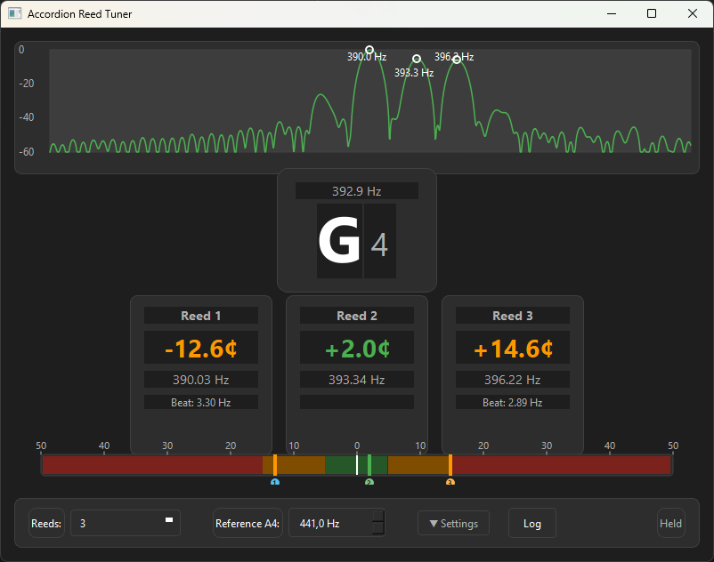

# Accordion Tuner

A musical instrument tuner specialized for accordion reed tuning with multi-pitch detection, temperament support, and beat frequency measurement.



## Features

- Multi-reed detection (1-4 simultaneous reeds)
- Beat frequency calculation for tremolo/musette tuning
- 32 historical temperaments
- Phase vocoder for accurate pitch detection
- Hold mode for capturing best measurement

## Installation

```bash
pip install -e ".[dev]"
```

## Usage

```bash
# Run the GUI
accordion-tuner

# Run CLI tuner
accordion-tuner-cli
```

## Acknowledgments

Originally inspired by [billthefarmer/ctuner](https://github.com/billthefarmer/ctuner), a cross-platform musical instrument strobe tuner.
